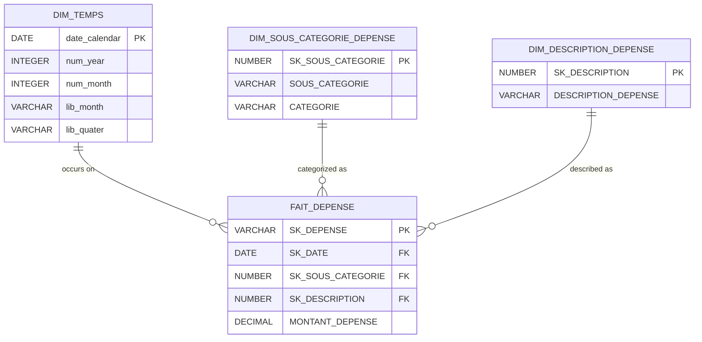

# Expense Tracking ETL Pipeline

**Project Type:** Data Engineering Lab / Showcase  
**Tech Stack:** Talend Open Studio, Snowflake, Power BI, SQL.

## Overview
This repository hosts an end-to-end data pipeline designed to ingest personal expense data, transform it into a dimensional model, and visualize it. It demonstrates a full ETL lifecycle from raw file ingestion to BI reporting.

**Note:** The source code in this repo consists of Talend-generated Java/XML configuration files. The logic is defined in the ETL jobs described below.

## Architecture

1.  **Ingestion (Extract):**
    * Retrieves raw excel files (`SAISIE_DEPENSE.xlsx`) from Google Drive.
    * Loads data into **Snowflake** staging tables (ODS Layer).

2.  **Transformation (Transform):**
    * Cleans and structures data into a **Star Schema** (DWH Layer).
    * **Fact Table:** `Fact_Expense` (Transactions).
    * **Dimensions:** `Dim_Category`, `Dim_Time`, `Dim_Description`.

3.  **Visualization (Load/Serve):**
    * Power BI connected to Snowflake DWH.
    * Key metrics: Monthly burn rate, Fixed vs. Variable split, Category drill-down.

## Visual Output (Power BI)

### Dashboard Overview

### Entity-Relationship Diagram (ERD)

## Implementation Details

### 1. Data Modeling (Snowflake)
The database schema uses a **Star Schema** optimized for analytics.
* **Source Code:** [View SQL DDL Script](./sql/init_warehouse.sql)
* **Fact Table:** `FAIT_DEPENSE` connects transactions to dimensions via surrogate keys.
* **Dimensions:**
    * `DIM_TEMPS`: Custom Calendar table with quarters and semesters (`lib_quater`, `lib_semester`).
    * `DIM_SOUS_CATEGORIE_DEPENSE`: Denormalized dimension containing both Category and Sub-Category logic.
    * `DIM_DESCRIPTION_DEPENSE`: Isolates transaction descriptions to reduce redundancy.

### 2. ETL Logic & Java Injection (Talend)
The pipeline goes beyond simple mapping by injecting Java logic for data transformation:
* **Time Dimension Generation:** Usage of `tRowGenerator` combined with `tMap` and Java expressions (e.g., `TalendDate.addDate`, `TalendDate.getPartOfDate`) to creating a calendar table from scratch without external source files.
* **Job Orchestration:** Implementation of `tPrejob` and `tPostjob` components to manage Snowflake connection lifecycles (Open/Close) efficiently and ensure resource cleanup.
* **Data Enrichment:** Complex mapping in `tMap` to handle Lookups between the Staging Area (ODS) and Dimensions.

### 3. Analytics (Power BI)
The dashboard leverages the underlying star schema to allow:
* **Decomposition Analysis:** Using Decomposition Trees to break down spending from Macro-Categories (e.g., "Home") to specific transaction IDs (`SK_DEPENSE`).
* **Temporal Drilling:** Full drill-down capability from Yearly aggregates down to daily transaction granularity.
